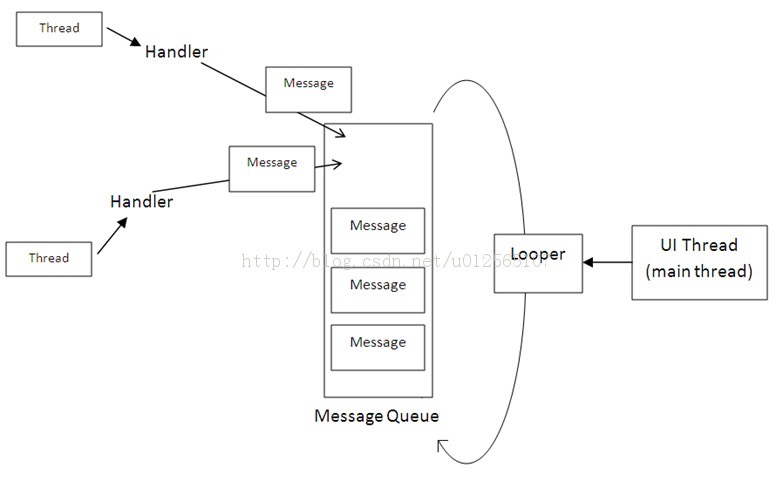

# Handler简单释义

我们都知道UI主线程中不能随意在启动一个进程进行改变UI，Google这样做的原因是为了保证UI主线程的安全性。  
那么如果我们想在子线程中改变UI，我们就需要用到Handler。如进行在下载图片、下载音乐等大文件耗时长的业务，必须使用多线程，让耗时操作在子线程中进行。这时我们就要使用Handler，使用Handler同时要使用Message。

## Handler是什么？

Handler是一个用于管理Message的类，并且与子线程一一对应，即每个子线程Thread都有一个Handler，每个Handler都管理着一个Message。

## Handler的使用流程

- 每个UI主线程会有一个Looper，Looper管理一个消息队列MessageQueue，MessageQueue用户存储handler发送过来的Message。  

- 每个Handler对应一个Thread，通过Looper循环Message，将Message取出发送给不同的Handler进行处理，更新UI。  

- 通过定义一个事件启动一个后台的Thread中进行异步任务，如访问数据库取数据等等，HTTP请求，当执行完后由Handler使用sendMessage()数据放入message中。

- Looper循环MessageQueue将Message取出，交由Handler进行处理，处理方法为handleMessage();

如下图：



## 简单例子解释如何使用Handler
在UI主线程中通过点击按钮启动一个子线程更新TextView的内容。

- UI主线程代码

  ```java
    @Override
    protected void onCreate(Bundle savedInstanceState) {
        super.onCreate(savedInstanceState);
        setContentView(R.layout.activity_main);
        textView = (TextView)findViewById(R.id.msg);
        button =(Button)findViewById(R.id.button);
        button.setOnClickListener(new View.OnClickListener() {
            @Override
            public void onClick(View v) {
                new Thread(new MyThread()).start();//在点击事件中启动一个新的线程
            }
        });
    }
 ```
    
- 自定义线程的处理逻辑

	每隔半秒种改变一次TextView中的内容，改变101次
	
	```java
	class MyThread implements Runnable{
        @Override
        public void run() {
		//run()方法中执行异步逻辑，如下载图片，下载文件等操作
            int count =0;
            while (count<=100){
                try{
                    Thread.sleep(500);
                }catch (Exception e){
                    e.printStackTrace();
                }
                Message message = Message.obtain();//获取消息
                message.arg1=count;
                message.obj="King";
                count++;
                handler.sendMessage(message);//发送消息到消息队列中
            }
        }
    }
    ```
- Handler的代码

	```java
    private Handler handler = new Handler(){
	   //实现handlerMessage方法进行操作UI
        @Override
        public void handleMessage(Message msg) {
            super.handleMessage(msg);
            textView.setText((String)msg.obj+msg.arg1);
        }
    };
	```
	
## 和Handler类似作用的Asynctask，二者的比较

AsyncTask在代码上比handler要轻量级别，而实际上要比handler更耗资源，因为AsyncTask底层是一个线程池，意味着每个AsyncTask都需要排队逐个运行，这样若一个AsyncTask长时间运行则会阻塞其他的AsyncTask！AsyncTask本质上是对Handler进行了一层封装。  

Handler仅仅就是发送了一个消息队列，连线程都没有开，并且每次开启一个新的进程，长时间耗时的异步建议使用。  
	

AsyncTask在使用多个异步操作和并需要进行Ui变更时,就变得复杂起来.
Handler在单个后台异步处理时，显得代码过多，结构过于复杂（相对性）


