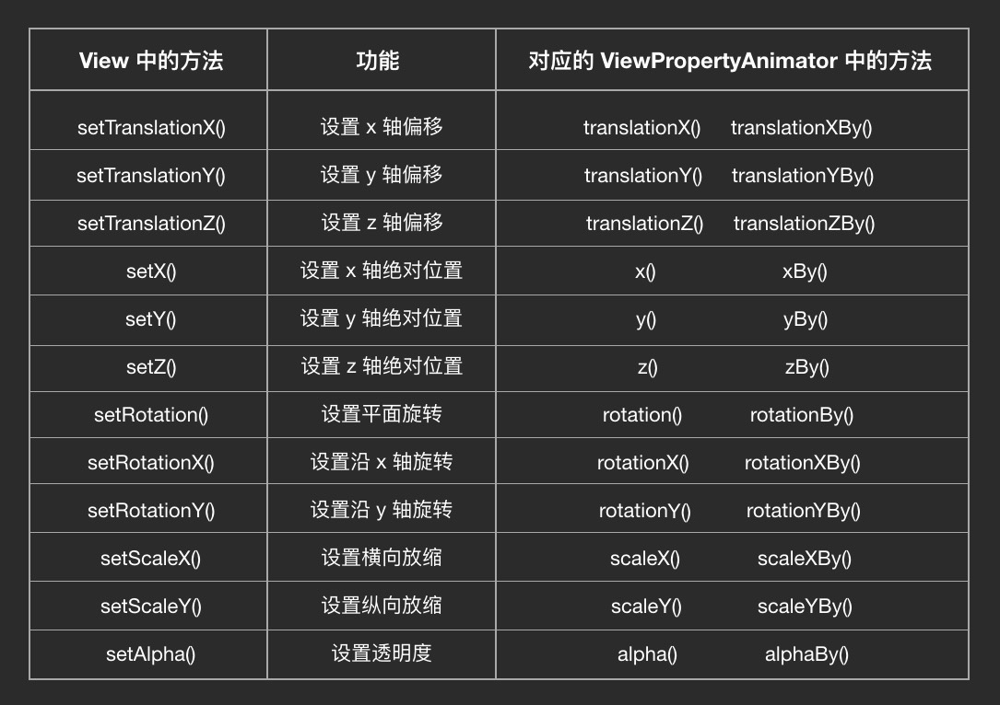

# 属性动画

属性动画Api是在Android3.0后加入到Android大家庭的，它主要有两种：

- ViewPropertyAnimator 主要用于一些简单属性的动画，Android将他们封装起来，方便调用

- ObjectAnimator	用于自定义属性动画，相对比较复杂

## ViewPropertyAnimator

- 使用方法

	使用view.animate()方法获得ViewPropertyAnimator对象，调用ViewPropertyAnimator对象的translationX()、translationY、translationZ、rotation()等方法操作View，让View动起来。
  
	具体API如下：

	

	可以看出View中的每个属性都有一个setter，而对应的ViewPropertyAnimator中也有相应的方法，可以理解为一一对应的关系。其中XXXBy()方法是将属性增加到一个值，如tanslationXBy(100)，是将X的位置**增加**100，而tanslationX()是将X的位置**增加到**100。
	
- 设置监听器，监听动画状态
	
	- 添加动画监听器 
		
		> ViewPropertyAnimator.setListener(AnimatorListener listener)  
		> ViewPropertyAnimator.setUpdateListener(AnimatorUpdateListener listener)，它只有一个回调方法onAnimationUpdate(ValueAnimator animation)。
		
	- 取消动画监听器 
		> ViewPropertyAnimator.setListener(null)  
		> ViewPropertyAnimator.setUpdateListener(null)
		
	- ViewPropertyAnimator.withStartAction(Runnable runnable)，只会调用一次，在动画开始时
	- ViewPropertyAnimator.withEndAction(Runnable runnable)，自己调用一次，在动画结束时，而且只有在正常end的时候调用，cancel时不会调用

## ObjectAnimator

- ObjectAnimator的通用使用方式：

	1. 自定义View中的自定义属性，编写setter和getter，注意setter要添加invalidate()方法通知界面重绘。

	2. 用ObjectAnimator.ofXXX()方法创建ObjectAnimator的对象。XXX表示不同属性的类型，如float、int等

	3. 调用start()方法启动动画。

- ofInt()

- ofFloat()

- ofObject():需要借助自定义的Evaluator来对一个对象做动画，使用方式为：

	> 1.为目标属性写一个自定义的 TypeEvaluator  
	> 2.使用 ofObject() 来创建 Animator，并把自定义的 TypeEvaluator 作为参数填入	


- 设置监听器，监听动画状态
	
	- 添加动画监听器 
		
		> ObjectAnimator.addListener(AnimatorListener listener)  
		> ObjectAnimator.addUpdateListener(AnimatorUpdateListener listener)，它只有一个回调方法onAnimationUpdate(ValueAnimator animation)。
		> ObjectAnimator.addPauseListener()
		
	- 取消动画监听器 
		> ObjectAnimator.addListener(null)  
		> ObjectAnimator.addUpdateListener(null)
		> ObjectAnimator.addPauseListener(null)
		
- TypeEvaluator 

	适合插值器Interpolator对应的估值器，Interpolator是有时间完成度转换为动画完成度的，而TypeEvaluator是由动画完成度来实际的属性的值。

	TypeEvaluator 的常用用法是使用 ArgbEvaluator 来做颜色渐变的动画。

	也可以自定义Evaluator来自定义动画，通过重写Evaluator中的evaluate()方法来实现的。
	
- PropertyValuesHolder

	主要用于实现和View.animator().scaleX(1).scaleY(1).alpha(1)这样的动画，为自定义的View同时执行多个动画.使用方法如下
	
	```java
	
	PropertyValuesHolder holder1 = PropertyValuesHolder.ofFloat("scaleX", 1);  
	PropertyValuesHolder holder2 = PropertyValuesHolder.ofFloat("scaleY", 1);  
	PropertyValuesHolder holder3 = PropertyValuesHolder.ofFloat("alpha", 1);
	ObjectAnimator animator = ObjectAnimator.ofPropertyValuesHolder(view
	                                    ,holder1, holder2, holder3);  
	animator.start();
	```	
	
	PropertyValuesHolder还有ofKeyFrame()将一个动画的关键帧进行拆分，来将动画的一个属性分成多个阶段。		

## 通用功能

- 设置动画的持续时间setDuration()

- setInterpolator()，设置插值器（速度设置器），动画的完成度和动画持续时间之前的关系。使用它们可以绘制出看起来比较舒服的动画。

	| 插值器 | 说明  | 
	| :---------------------------: | :--------------------------: | 
	| AccelerateDecelerateInterpolator | 先加速再减速（默认的插值器） | 
	|  LinearInterpolator   |    匀速   |    
	| AccelerateInterpolator    | 在整个动画过程中，一直在加速，直到动画结束的一瞬间，直接停止     |      
	| DecelerateInterpolator    | 动画开始的时候是最高速度，然后在动画过程中逐渐减速，直到动画结束的时候恰好减速到 0      |      
	| AnticipateInterpolator    | 先回拉一下再进行正常动画轨迹。效果看起来有点像投掷物体或跳跃等动作前的蓄力      |      
	| OvershootInterpolator    | 动画会超过目标值一些，然后再弹回来。效果看起来有点像你一屁股坐在沙发上后又被弹起来一点的感觉。      |      
	| AnticipateOvershootInterpolator    | 上面这两个的结合版：开始前回拉，最后超过一些然后回弹。      |      
	| BounceInterpolator    | 在目标值处弹跳。有点像玻璃球掉在地板上的效果      |      
	| CycleInterpolator    | 这个是一个正弦 / 余弦曲线，不过它和 AccelerateDecelerateInterpolator 的区别是，它可以自定义曲线的周期，所以动画可以不到终点就结束，也可以到达终点后回弹，回弹的次数由曲线的周期决定，曲线的周期由 CycleInterpolator() 构造方法的参数决定。      |      
	| PathInterpolator    |  用这个 Interpolator 你可以定制出任何你想要的速度模型。定制的方式是使用一个 Path 对象来绘制出你要的动画完成度 / 时间完成度曲线。     |      
	| FastOutLinearInInterpolator    | 加速运动，其实它和  AccelerateInterpolator 一样，都是一个持续加速的运动路线。只不过  FastOutLinearInInterpolator 的曲线公式是用的贝塞尔曲线，而 AccelerateInterpolator 用的是指数曲线      | 
	|	LinearOutSlowInInterpolator 	|	持续减速。它和 DecelerateInterpolator 比起来，同为减速曲线，主要区别在于 LinearOutSlowInInterpolator 的初始速度更高。对于人眼的实际感觉，区别其实也不大，不过还是能看出来一些的。 |   
	|	FastOutSlowInInterpolator	|	先加速再减速。同样也是先加速再减速的还有前面说过的 AccelerateDecelerateInterpolator，不过它们的效果是明显不一样的。FastOutSlowInInterpolator 用的是贝塞尔曲线，AccelerateDecelerateInterpolator 用的是正弦 / 余弦曲线。具体来讲， FastOutSlowInInterpolator 的前期加速度要快得多 |  

## AnimatorSet 

用于控制一个动画集合的执行，比如先执行一个动画，然后执行另一个动画等。它的主要API有：

- play()
- playTogether()
- with()
- before()
- after()
